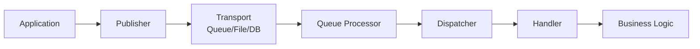

SimpleMessageBus is built around a few core concepts that work together to provide a simple yet powerful messaging system. Understanding these concepts will help you effectively use the library in your applications.

## Architecture Overview


SimpleMessageBus follows a publisher-subscriber pattern with the following key components:

- **Messages**: Data structures that carry information between components
- **Publishers**: Components that send messages to a transport mechanism
- **Handlers**: Components that process messages when they are received
- **Dispatchers**: Components that coordinate message delivery to handlers
- **Providers**: Transport-specific implementations (Azure, AWS, File System, IndexedDB)

## Messages

Messages are the fundamental units of communication in SimpleMessageBus. They represent events, commands, or notifications that need to be processed.

<Steps>
  <Step title="Define the Message Contract">
    All messages must implement the `IMessage` interface:

    ```csharp
    public interface IMessage
    {
        // Marker interface - no members required
    }
    ```
  </Step>

  <Step title="Implement Your Message">
    Create a message class with the data you need to communicate:

    ```csharp
    public class OrderProcessedMessage : IMessage
    {
        public string OrderId { get; set; }
        public decimal TotalAmount { get; set; }
        public DateTime ProcessedAt { get; set; }
        public string CustomerId { get; set; }
    }
    ```
  </Step>

  <Step title="Understand the Message Envelope">
    Internally, SimpleMessageBus wraps your messages in a `MessageEnvelope` that adds metadata:

    ```csharp
    public class MessageEnvelope
    {
        public string MessageId { get; set; }
        public string MessageType { get; set; }
        public string CorrelationId { get; set; }
        public DateTime Timestamp { get; set; }
        public string Content { get; set; } // Serialized message
        public Dictionary<string, object> Headers { get; set; }
    }
    ```
  </Step>
</Steps>

## Publishers

Publishers are responsible for sending messages to the underlying transport mechanism. They serialize messages and handle transport-specific details.

### IMessagePublisher Interface

```csharp
public interface IMessagePublisher
{
    Task PublishAsync<T>(T message) where T : IMessage;
    Task PublishAsync<T>(T message, CancellationToken cancellationToken) where T : IMessage;
}
```

### Usage Example

```csharp
public class OrderService
{
    private readonly IMessagePublisher _publisher;

    public OrderService(IMessagePublisher publisher)
    {
        _publisher = publisher;
    }

    public async Task ProcessOrder(Order order)
    {
        // Process the order
        await SaveOrderToDatabase(order);

        // Publish message
        await _publisher.PublishAsync(new OrderProcessedMessage
        {
            OrderId = order.Id,
            TotalAmount = order.Total,
            ProcessedAt = DateTime.UtcNow,
            CustomerId = order.CustomerId
        });
    }
}
```

## Handlers

Handlers contain the business logic for processing messages. They implement the `IMessageHandler<T>` interface.

### IMessageHandler Interface

```csharp
public interface IMessageHandler<in T> where T : IMessage
{
    Task HandleAsync(T message);
}
```

### Handler Implementation

```csharp
public class OrderProcessedHandler : IMessageHandler<OrderProcessedMessage>
{
    private readonly IEmailService _emailService;
    private readonly ILogger<OrderProcessedHandler> _logger;

    public OrderProcessedHandler(IEmailService emailService, ILogger<OrderProcessedHandler> logger)
    {
        _emailService = emailService;
        _logger = logger;
    }

    public async Task HandleAsync(OrderProcessedMessage message)
    {
        _logger.LogInformation("Processing order {OrderId} for customer {CustomerId}", 
            message.OrderId, message.CustomerId);

        try
        {
            // Send confirmation email
            await _emailService.SendOrderConfirmationAsync(
                message.CustomerId, 
                message.OrderId, 
                message.TotalAmount);

            _logger.LogInformation("Order confirmation sent for {OrderId}", message.OrderId);
        }
        catch (Exception ex)
        {
            _logger.LogError(ex, "Failed to send order confirmation for {OrderId}", message.OrderId);
            throw; // Re-throw to trigger retry mechanisms
        }
    }
}
```

## Dispatchers

Dispatchers coordinate the delivery of messages from the transport mechanism to the appropriate handlers. They handle deserialization, routing, and error handling.

### IMessageDispatcher Interface

```csharp
public interface IMessageDispatcher
{
    Task DispatchAsync(MessageEnvelope envelope);
    Task DispatchAsync(MessageEnvelope envelope, CancellationToken cancellationToken);
}
```

### Dispatcher Types

<AccordionGroup>
  <Accordion title="Parallel Dispatcher" icon="arrows-split-up-and-left">
    Processes messages concurrently for maximum throughput:

    ```csharp
    services.AddSimpleMessageBusParallelDispatcher(options =>
    {
        options.MaxConcurrency = Environment.ProcessorCount * 2;
        options.BatchSize = 10;
    });
    ```

    **Best for**: High-throughput scenarios where message order doesn't matter.
  </Accordion>

  <Accordion title="Ordered Dispatcher" icon="list-ol">
    Processes messages sequentially to maintain order:

    ```csharp
    services.AddSimpleMessageBusOrderedDispatcher();
    ```

    **Best for**: Scenarios where processing order must be maintained.
  </Accordion>
</AccordionGroup>

## Queue Processors

Queue processors are provider-specific components that poll the underlying transport for new messages and forward them to dispatchers.

### IQueueProcessor Interface

```csharp
public interface IQueueProcessor
{
    Task StartAsync(CancellationToken cancellationToken);
    Task StopAsync(CancellationToken cancellationToken);
}
```

### Provider-Specific Processors

<AccordionGroup>
  <Accordion title="Azure Storage Queue Processor" icon="cloud">
    Polls Azure Storage Queues for new messages using configurable polling intervals.

    **Features**:
    - Configurable polling intervals
    - Automatic message visibility timeout handling
    - Batch message retrieval
  </Accordion>

  <Accordion title="Amazon SQS Processor" icon="aws">
    Long-polls Amazon SQS queues for efficient message retrieval.

    **Features**:
    - Long polling support (up to 20 seconds)
    - FIFO queue support
    - Dead letter queue integration
  </Accordion>

  <Accordion title="File System Processor" icon="folder">
    Watches file system directories for new message files.

    **Features**:
    - FileSystemWatcher integration
    - Automatic file cleanup
    - Error file handling
  </Accordion>

  <Accordion title="IndexedDB Processor" icon="database">
    Monitors IndexedDB for new messages in Blazor WebAssembly applications.

    **Features**:
    - Browser-native storage
    - Offline-first support
    - Client-side message processing
  </Accordion>
</AccordionGroup>

## Message Flow

Here's how messages flow through the system:



1. **Application** creates and publishes a message
2. **Publisher** serializes and sends the message to the transport
3. **Transport** stores the message (queue, file, database)
4. **Queue Processor** retrieves the message from transport
5. **Dispatcher** deserializes and routes the message
6. **Handler** processes the message with business logic

## Error Handling

SimpleMessageBus provides several mechanisms for handling errors:

<AccordionGroup>
  <Accordion title="Retry Mechanisms" icon="arrows-rotate">
    Most providers support automatic retry with configurable policies:

    ```csharp
    services.AddSimpleMessageBusAzureStorageDispatcher(options =>
    {
        options.MaxRetryAttempts = 3;
        options.RetryDelay = TimeSpan.FromSeconds(30);
        options.BackoffMultiplier = 2.0;
    });
    ```

    Configure exponential backoff to handle transient failures gracefully.
  </Accordion>

  <Accordion title="Dead Letter Queues" icon="skull-crossbones">
    Failed messages can be automatically moved to dead letter queues:

    ```csharp
    services.AddSimpleMessageBusAmazonSQSDispatcher(options =>
    {
        options.DeadLetterQueueName = "failed-messages";
        options.MaxDeliveryCount = 5;
    });
    ```

    Isolate poison messages for later analysis and manual intervention.
  </Accordion>

  <Accordion title="Exception Handling" icon="shield-exclamation">
    Handlers should implement proper exception handling:

    ```csharp
    public async Task HandleAsync(MyMessage message)
    {
        try
        {
            await ProcessMessage(message);
        }
        catch (BusinessException ex)
        {
            // Log and ignore - don't retry business rule violations
            _logger.LogWarning(ex, "Business rule violation for message {MessageId}", message.Id);
        }
        catch (TransientException ex)
        {
            // Log and re-throw - allow retry for transient failures
            _logger.LogError(ex, "Transient error processing message {MessageId}", message.Id);
            throw;
        }
    }
    ```

    Distinguish between retriable transient failures and permanent business logic errors.
  </Accordion>
</AccordionGroup>

## Next Steps

Now that you understand the core concepts, dive deeper into specific areas:

<CardGroup cols={2}>
  <Card
    title="Messages"
    icon="envelope"
    href="/simplemessagebus/concepts/messages"
  >
    Learn about message design and best practices
  </Card>
  <Card
    title="Publishers"
    icon="paper-plane"
    href="/simplemessagebus/concepts/publishers"
  >
    Understand publishing patterns and configuration
  </Card>
  <Card
    title="Handlers"
    icon="gear"
    href="/simplemessagebus/concepts/handlers"
  >
    Master message processing and error handling
  </Card>
  <Card
    title="Dispatchers"
    icon="route"
    href="/simplemessagebus/concepts/dispatchers"
  >
    Configure message routing and concurrency
  </Card>
</CardGroup>